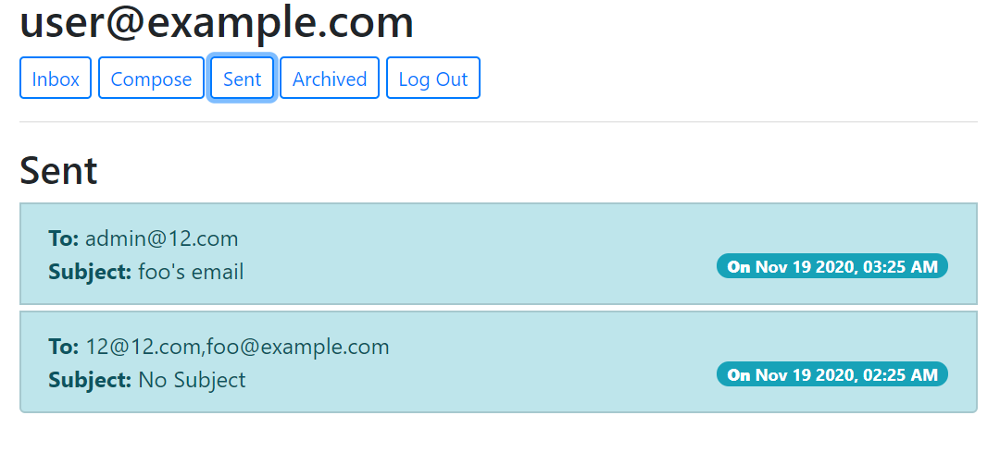

# Specification
This is a single-page email app makes API calls to send and receive emails, implementing by vanilla JavaScript, HTML, and Django backend. 
<a href="https://cs50-mail.herokuapp.com/">Live Demo</a> 
Email: user@example.com  
PSW: 123 

# Features 
## Mailbox:
When a user visits their Inbox, Sent mailbox, or Archive, load the appropriate mailbox. 

## Send Mail:
When a user submits the email composition form, the JavaScript code actually send the email to recipients registered in the database.

## View Email:
Request the email and render a view displaying its content. Once clicked on, the email should be marked as read. Allow users to archive/unarchive received emails (but not applying to sent emails).

## Reply:
When the user clicks the “Reply” button, a pre-filled email composition form will be returned. 